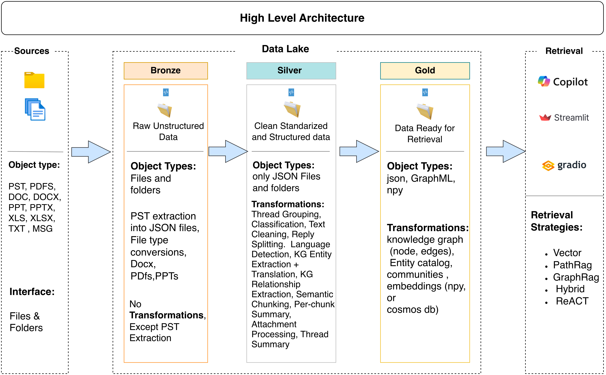

<div align="center">

# TacitGraph

### From PST to a knowledge graph you can chat with

**An end-to-end RAG pipeline:** email ingestion, knowledge-graph construction and graph-aware retrieval, running fully local or with a cloud LLM.

*Structuring unstructured expert knowledge — Outlook archives and their attachments become a knowledge graph you can question in plain language.*

[](https://github.com/MRafiqAsim/tacitgraph/actions/workflows/ci.yml)
[](pyproject.toml)
[](LICENSE)
[](https://github.com/astral-sh/uv)
[](https://github.com/astral-sh/ruff)
[](https://paypal.me/mrafiq89/5EUR)

</div>

---

Much of an organisation's know-how never reaches a wiki. It lives in years of email threads, forwarded reports and spreadsheets attached to replies — *tacit knowledge* that leaves with the people who wrote it. TacitGraph turns those mailbox archives into a queryable knowledge system:

- **Ingests Outlook PST archives** and loose documents (PDF, Word, Excel, PowerPoint, MSG, RTF), reconstructs threads and extracts attachments.
- **Separates work from personal mail**, cleans quoted replies, signatures and disclaimers, detects English/Dutch content and, in LLM mode, translates it to English.
- **Builds a knowledge graph** of people, organisations, projects, products and processes, with Leiden community detection on top.
- **Answers questions with five retrieval strategies** — vector, GraphRAG, PathRAG, hybrid fusion and a ReAct agent — with source citations back to the original emails.
- **Runs fully local or with a cloud LLM**: open models on your own machine (spaCy, Presidio, DistilBART, bge-m3 embeddings, Llama 3.1 through [Ollama](https://ollama.com)) or GPT-4o via Azure OpenAI / OpenAI. No email leaves the machine in local mode.

## Which edition do you need?

TacitGraph comes in two editions that share the same pipeline and retrieval strategies:

| | [**TacitGraph**](https://github.com/MRafiqAsim/tacitgraph) — local | [**TacitGraph · Azure**](https://github.com/MRafiqAsim/tacitgraph-azure) — cloud |
|---|---|---|
| Runs on | A laptop or a single server, natively or in Docker | Azure managed services |
| Processing | Command-line tools | Synapse Analytics (Spark pool); PST extraction runs locally |
| Data layers | JSON files on disk | ADLS Gen2 |
| Knowledge graph | NetworkX (GraphML / JSON files) | Cosmos DB (Gremlin API), plus NetworkX in memory for PathRAG |
| Search | In-memory BM25 + exact vector search, fused with RRF | Azure AI Search: HNSW vectors + BM25 + semantic ranker |
| Chat model | Ollama (Llama 3.1 by default), Azure OpenAI or OpenAI | Azure OpenAI (GPT-4o) |
| Embeddings | bge-m3 locally, or OpenAI | Azure OpenAI (text-embedding-3-small) |
| Chat UI | Gradio on your machine | Gradio on App Service |
| Best for | Personal and team archives, offline or private use, trying it out | Organisation-wide archives and many concurrent users |
| Cost | Your own hardware | Azure consumption |

> **You are in the local edition.** Building on Azure with ADLS Gen2, Cosmos DB Gremlin and AI Search? Use **[tacitgraph-azure](https://github.com/MRafiqAsim/tacitgraph-azure)**.

## How it works

TacitGraph follows a medallion architecture: each layer is a set of plain JSON files you can inspect.

### High level architecture



### Data flow


### Retrieval strategies

| Strategy | Best for | How it retrieves |
|---|---|---|
| **Vector** | Specific facts, names, ticket numbers | Dense embeddings and a BM25 keyword index fused with Reciprocal Rank Fusion, expanded with sibling emails from the same thread |
| **GraphRAG** | Themes and "what is discussed about…" | Local search over an entity's graph neighbourhood, or global search over community summaries |
| **PathRAG** | "How is X connected to Y?" | Finds multi-hop paths between query entities in the graph and prunes them by information flow |
| **Hybrid** | Mixed or open-ended questions — a robust choice when unsure which strategy fits | Weighted fusion of vector (0.3), PathRAG (0.4) and GraphRAG (0.3) |
| **ReAct** | Multi-step questions | An agent that plans, calls the other strategies as tools and cross-checks the evidence |

Every strategy answers through a chat model — a local one through Ollama (the default) or Azure OpenAI / OpenAI — and cites the emails it used. If the chat model is not reachable, the app says so and explains how to start it.

### Processing modes

| Mode | Classification, NER, summaries | Cost |
|---|---|---|
| `local` | spaCy (EN/NL), Presidio, regex, DistilBART | Free, runs offline |
| `llm` | GPT-4o for classification, extraction, translation and summaries | API usage |
| `hybrid` | Local first; the LLM verifies low-confidence results | Reduced API usage |

### Technology stack

| Component | Local (NLP) mode | LLM mode |
|---|---|---|
| Work / personal classification | Rule-based ([`config/sensitivity_rules.yaml`](config/sensitivity_rules.yaml)) | GPT-4o |
| PII detection | Presidio + spaCy | GPT-4o |
| Named entities | spaCy (`en_core_web_trf`, `nl_core_news_lg`) | GPT-4o, normalised to English |
| Relationships | spaCy dependency parsing | GPT-4o |
| Translation | — (multilingual embeddings) | GPT-4o, in the same call as entity extraction |
| Summaries | DistilBART (`sshleifer/distilbart-cnn-12-6`) | GPT-4o |
| Embeddings | bge-m3 (1024 dims, multilingual) | text-embedding-3-small (1536 dims) |
| Answers | Local LLM via Ollama (Llama 3.1 8B) | GPT-4o |
| Graph | NetworkX + Leiden communities | NetworkX + Leiden communities |
| Storage | JSON files and `.npy` embeddings | JSON files and `.npy` embeddings |
| UI | Gradio | Gradio |

## Quickstart

Requires Python 3.11+ and [uv](https://docs.astral.sh/uv/). PST parsing compiles `libpff-python` and uses a few system tools (Debian/Ubuntu/WSL shown; the Docker image below has them built in):

```bash
sudo apt install -y build-essential   # compiles libpff-python (PST parsing)
sudo apt install -y antiword          # legacy .doc attachments
sudo apt install -y poppler-utils     # PDF pages to images for scanned documents
sudo apt install -y libreoffice-core  # optional: legacy Office format conversion
sudo apt install -y pst-utils         # optional: readpst fallback for damaged PSTs
```

```bash
git clone https://github.com/MRafiqAsim/tacitgraph.git
cd tacitgraph

# Core + PST/document parsing + local NLP models
uv sync --extra ingest --extra nlp --group models

cp .env.template .env   # optional: cloud LLM credentials for llm/hybrid modes

# Local chat model for answers (any OpenAI-compatible server works)
ollama pull llama3.1:8b
```

Run the pipeline layer by layer:

```bash
# 1. Bronze: extract emails, attachment text and threads into ./data/bronze
uv run tacitgraph-ingest --pst ./archive.pst --output ./data

# 2. Silver: classify, clean, chunk and extract entities/relationships → ./data/silver_local
uv run tacitgraph-process --mode local --with-summaries

# 3. Gold: knowledge graph, communities, paths and embeddings → ./data/gold_local
uv run tacitgraph-index --mode local --all

# 4. Ask
uv run tacitgraph-query --mode local --strategy hybrid -q "Who worked on the ERP migration?"
uv run tacitgraph-app --mode local          # chat UI on http://localhost:7861
```

To use GPT-4o for extraction, translation and summaries instead, put Azure OpenAI or OpenAI credentials in `.env` and swap the mode:

```bash
uv run tacitgraph-process --mode llm --with-summaries   # → ./data/silver_llm
uv run tacitgraph-index   --mode llm --all              # → ./data/gold_llm
uv run tacitgraph-app     --mode llm
```

Useful options for large archives:

```bash
uv run tacitgraph-ingest  --pst ./archive.pst --output ./data --limit 50   # try a small sample first
uv run tacitgraph-process --mode local --resume                            # continue an interrupted run
uv run tacitgraph-index   --mode local --generate-embeddings --skip-graph  # re-embed only

# Statistics and interactive graph views (HTML)
uv run python scripts/silver_stats.py --silver data/silver_local --bronze data/bronze
uv run python scripts/gold_stats.py --gold data/gold_local
uv run python scripts/visualize_graph.py --gold data/gold_local --type PERSON ORG --max-nodes 200
uv run python scripts/visualize_communities.py --gold data/gold_local --level 1
```

### Or run everything with Docker

No local Python needed — the image contains the pipeline CLIs, the local NLP models and the chat app:

```bash
docker compose build
mkdir -p data && cp /path/to/archive.pst data/

docker compose run --rm tacitgraph tacitgraph-ingest  --pst data/archive.pst --output data
docker compose run --rm tacitgraph tacitgraph-process --mode local --with-summaries
docker compose run --rm tacitgraph tacitgraph-index   --mode local --all
docker compose up                                      # chat UI on http://localhost:7861
```

Pipeline output is written to `./data` on your machine; downloaded models are cached in a Docker volume. The container reaches Ollama on the host at `host.docker.internal:11434`.

Every command supports `--help`. Optional extras: `ingest` (PST and document parsing), `nlp` (local NLP mode), `eval` (RAGAS), `azure` (AI Search / Cosmos DB backends), `pathrag` (reference PathRAG implementation), or `all`.

## Configuration

| What | Where |
|---|---|
| Chat model and embedding model | [`config/models.json`](config/models.json) — one line each |
| Credentials, mode, retrieval options | `.env` (see [`.env.template`](.env.template)) |
| Description of your corpus, injected into every LLM prompt | `PROMPT_DOMAIN_CONTEXT` in `.env`, or `domain_context` in [`config/prompts.json`](config/prompts.json) |
| All LLM prompts | [`config/prompts.json`](config/prompts.json) |
| Entity types, relationship normalisation, name aliases | [`config/entity_config.json`](config/entity_config.json) |
| Work / personal classification rules | [`config/sensitivity_rules.yaml`](config/sensitivity_rules.yaml) |

Switching models is a one-line change in `config/models.json`:

```json
{
  "llm":       { "local": { "base_url": "http://localhost:11434/v1", "model": "llama3.1:8b" } },
  "embedding": { "local_model": "BAAI/bge-m3" }
}
```

`model` takes any model your server provides (`qwen2.5:7b`, `mistral`, …). `LOCAL_LLM_BASE_URL` and `LOCAL_LLM_MODEL` override the file, and Azure OpenAI or OpenAI credentials in `.env` take precedence over the local server. If the server is not reachable, the chat shows how to start it and reconnects on the next question. The embedding model is recorded with the index, so queries always use the model the index was built with; after changing it, rebuild embeddings with `tacitgraph-index --mode local --generate-embeddings --skip-graph`.

The keyword index is built in memory from the Silver chunks on the first query — instant for a personal archive; for millions of chunks, a persistent search engine (the Azure deployment uses AI Search) is the better fit.

Adapting TacitGraph to a new organisation is mostly configuration: describe the corpus, add known name aliases (e.g. `"Acme Corporation" → "Acme"`), and adjust classification keywords.

## Evaluation

Retrieval quality is measured with [RAGAS](https://docs.ragas.io/) — faithfulness, answer relevancy, context precision, context recall and answer correctness — against expert-written question/answer pairs:

```bash
uv sync --extra eval
uv run python scripts/run_ragas_eval.py --gold data/gold_llm --silver data/silver_llm --mode llm \
    --qa-file evaluation/expert_qa.example.json
```

Replace [`evaluation/expert_qa.example.json`](evaluation/expert_qa.example.json) with questions from people who know your corpus.

## Project layout

```
src/tacitgraph/
├── bronze/       PST extraction, document parsing, attachments, thread grouping
├── silver/       classification, cleaning, chunking, NER, relationships, summaries
├── gold/         graph builder, community detection, path index, embeddings
├── retrieval/    vector, GraphRAG, PathRAG, hybrid and ReAct retrievers
├── evaluation/   RAGAS and summarisation metrics
├── pipeline/     CLI entry points
├── storage/      optional Azure backends
├── pathrag/      adapted reference PathRAG implementation (MIT)
└── app.py        Gradio chat UI
config/           prompts, entity config, classification rules
scripts/          layer statistics and graph visualisation
tests/            pytest suite
```

## Development

```bash
uv sync --all-extras --group models   # omit --group models if you only run the tests
uv run pre-commit install
uv run pytest                 # unit tests
uv run ruff check . && uv run ruff format --check .
```

CI runs linting and the test suite on Python 3.11 and 3.12 for every push and pull request.

## Contributing

Issues and pull requests are welcome. Fork the repository, create a feature branch, run `uv run pre-commit run --all-files` and `uv run pytest`, and open a pull request against `main`.

## Privacy

Mailbox archives contain personal data. TacitGraph classifies and skips personal email, keeps processed data in local files you control (`data/` is git-ignored), and lets you choose a fully offline mode: in `local` mode with a local chat model no email content leaves your machine (cloud credentials in `.env` take precedence, so leave them empty for offline use). Once the models have been downloaded, set `HF_HUB_OFFLINE=1` to stop even model update checks, e.g. for air-gapped environments. Telemetry from Gradio and Hugging Face is disabled in the Docker image.

Make sure you are authorised to process the archives you load and follow your organisation's data-protection rules.

## Support

Did TacitGraph surface a piece of knowledge your inbox was hiding? Help fuel the next release with a [coffee (€5)](https://paypal.me/mrafiq89/5EUR) ☕ — or leave a ⭐ so the next team buried in PST files can find it too.

Want it tuned to your own archive? [Fork it](https://github.com/MRafiqAsim/tacitgraph/fork) and make it yours — that's what it's built for.

## Citation

If you use TacitGraph in research, please cite it — GitHub's *Cite this repository* button uses [`CITATION.cff`](CITATION.cff).

## License

[Apache License 2.0](LICENSE). The `src/tacitgraph/pathrag/` directory contains code adapted from [PathRAG](https://github.com/BUPT-GAMMA/PathRAG) and [LightRAG](https://github.com/HKUDS/LightRAG) under the MIT License; see [`NOTICE`](NOTICE).
