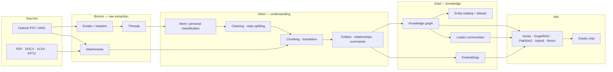
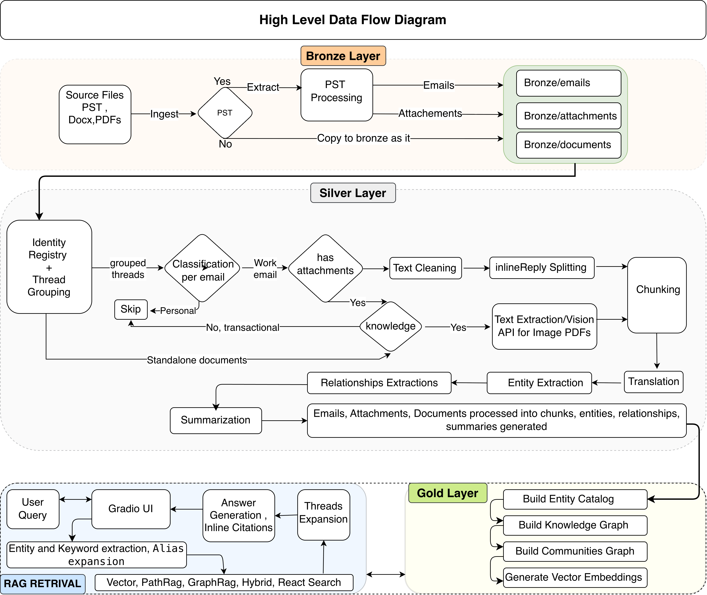

<div align="center">

# TacitGraph

### From PST to a knowledge RAG you can chat with.

*Structuring unstructured expert knowledge — Outlook archives and their attachments become a knowledge graph you can question in plain language.*

[](https://github.com/MRafiqAsim/tacitgraph/actions/workflows/ci.yml)
[](pyproject.toml)
[](LICENSE)
[](https://github.com/astral-sh/uv)
[](https://github.com/astral-sh/ruff)
[](https://paypal.me/PAYPAL_HANDLE/5EUR)

</div>

---

Much of an organisation's know-how never reaches a wiki. It lives in years of email threads, forwarded reports and spreadsheets attached to replies — *tacit knowledge* that leaves with the people who wrote it. TacitGraph turns those mailbox archives into a queryable knowledge system:

- **Ingests Outlook PST archives** and loose documents (PDF, Word, Excel, PowerPoint, MSG, RTF), reconstructs threads and extracts attachments.
- **Separates work from personal mail**, cleans quoted replies, signatures and disclaimers, detects English/Dutch content and, in LLM mode, translates it to English.
- **Builds a knowledge graph** of people, organisations, projects, products and processes, with Leiden community detection on top.
- **Answers questions with five retrieval strategies** — vector, GraphRAG, PathRAG, hybrid fusion and a ReAct agent — with source citations back to the original emails.
- **Runs fully local or with an LLM**: a zero-cost offline NLP mode (spaCy, Presidio, DistilBART, sentence-transformers) or GPT-4o via Azure OpenAI / OpenAI, plus a hybrid of both.

> Looking for the cloud deployment (Synapse, Cosmos DB, AI Search, App Service)? See **[tacitgraph-azure](https://github.com/MRafiqAsim/tacitgraph-azure)**.

## How it works

TacitGraph follows a medallion architecture: each layer is a set of plain JSON files you can inspect.



<details>
<summary>Detailed data flow</summary>



</details>

### Retrieval strategies

| Strategy | Best for | How it retrieves |
|---|---|---|
| **Vector** | Specific facts and quotes | Dual-vector similarity over chunk text and summaries, expanded with sibling emails from the same thread |
| **GraphRAG** | Themes and "what is discussed about…" | Local search over an entity's graph neighbourhood, or global search over community summaries |
| **PathRAG** | "How is X connected to Y?" | Finds multi-hop paths between query entities in the graph and prunes them by information flow |
| **Hybrid** | General questions | Weighted fusion of vector (0.3), PathRAG (0.4) and GraphRAG (0.3) |
| **ReAct** | Multi-step questions | An agent that plans, calls the other strategies as tools and cross-checks the evidence |

Vector, PathRAG and Hybrid work fully offline; in `local` mode their answers are extractive summaries of the retrieved emails. GraphRAG and ReAct need an LLM (`llm` or `hybrid` mode), which also produces fluent, cited answers for every strategy.

### Processing modes

| Mode | Classification, NER, summaries | Cost |
|---|---|---|
| `local` | spaCy (EN/NL), Presidio, regex, DistilBART | Free, runs offline |
| `llm` | GPT-4o for classification, extraction, translation and summaries | API usage |
| `hybrid` | Local first; the LLM verifies low-confidence results | Reduced API usage |

## Quickstart

Requires Python 3.11+ and [uv](https://docs.astral.sh/uv/).

```bash
git clone https://github.com/MRafiqAsim/tacitgraph.git
cd tacitgraph

# Core + PST/document parsing + local NLP models
uv sync --extra ingest --extra nlp --group models

cp .env.template .env   # add your LLM credentials for llm/hybrid modes
```

Run the pipeline layer by layer:

```bash
# 1. Bronze: extract emails, attachment text and threads into ./data/bronze
uv run tacitgraph-ingest --pst ./archive.pst --output ./data

# 2. Silver: classify, clean, chunk and extract entities/relationships → ./data/silver_local
uv run tacitgraph-process --mode local --with-summaries

# 3. Gold: knowledge graph, communities, paths and embeddings → ./data/gold_local
uv run tacitgraph-index --mode local --all

# 4. Ask
uv run tacitgraph-query --mode local --strategy hybrid -q "Who worked on the ERP migration?"
uv run tacitgraph-app --mode local          # chat UI on http://localhost:7861
```

### Or run everything with Docker

No local Python needed — the image contains the pipeline CLIs, the local NLP models and the chat app:

```bash
docker compose build
mkdir -p data && cp /path/to/archive.pst data/

docker compose run --rm tacitgraph tacitgraph-ingest  --pst data/archive.pst --output data
docker compose run --rm tacitgraph tacitgraph-process --mode local --with-summaries
docker compose run --rm tacitgraph tacitgraph-index   --mode local --all
docker compose up                                      # chat UI on http://localhost:7861
```

Pipeline output is written to `./data` on your machine; downloaded models are cached in a Docker volume.

Every command supports `--help`. Optional extras: `ingest` (PST and document parsing), `nlp` (local NLP mode), `eval` (RAGAS), `azure` (AI Search / Cosmos DB backends), `pathrag` (reference PathRAG implementation), or `all`.

## Configuration

| What | Where |
|---|---|
| Credentials, mode, retrieval options | `.env` (see [`.env.template`](.env.template)) |
| Description of your corpus, injected into every LLM prompt | `PROMPT_DOMAIN_CONTEXT` in `.env`, or `domain_context` in [`config/prompts.json`](config/prompts.json) |
| All LLM prompts | [`config/prompts.json`](config/prompts.json) |
| Entity types, relationship normalisation, name aliases | [`config/entity_config.json`](config/entity_config.json) |
| Work / personal classification rules | [`config/sensitivity_rules.yaml`](config/sensitivity_rules.yaml) |

Adapting TacitGraph to a new organisation is mostly configuration: describe the corpus, add known name aliases (e.g. `"Acme Corporation" → "Acme"`), and adjust classification keywords.

## Evaluation

Retrieval quality is measured with [RAGAS](https://docs.ragas.io/) — faithfulness, answer relevancy, context precision, context recall and answer correctness — against expert-written question/answer pairs:

```bash
uv sync --extra eval
uv run python scripts/run_ragas_eval.py --gold data/gold_llm --silver data/silver_llm --mode llm \
    --qa-file evaluation/expert_qa.example.json
```

Replace [`evaluation/expert_qa.example.json`](evaluation/expert_qa.example.json) with questions from people who know your corpus.

## Project layout

```
src/tacitgraph/
├── bronze/       PST extraction, document parsing, attachments, thread grouping
├── silver/       classification, cleaning, chunking, NER, relationships, summaries
├── gold/         graph builder, community detection, path index, embeddings
├── retrieval/    vector, GraphRAG, PathRAG, hybrid and ReAct retrievers
├── evaluation/   RAGAS and summarisation metrics
├── pipeline/     CLI entry points
├── storage/      optional Azure backends
├── pathrag/      adapted reference PathRAG implementation (MIT)
└── app.py        Gradio chat UI
config/           prompts, entity config, classification rules
scripts/          layer statistics and graph visualisation
tests/            pytest suite
```

## Development

```bash
uv sync --all-extras
uv run pre-commit install
uv run pytest                 # unit tests
uv run ruff check . && uv run ruff format --check .
```

CI runs linting and the test suite on Python 3.11 and 3.12 for every push and pull request.

## Privacy

Mailbox archives contain personal data. TacitGraph classifies and skips personal email, keeps processed data in local files you control (`data/` is git-ignored), and lets you choose a fully offline mode. Make sure you are authorised to process the archives you load and follow your organisation's data-protection rules.

## Support

If TacitGraph saves you time, you can [buy me a coffee (€5)](https://paypal.me/PAYPAL_HANDLE/5EUR) ☕ — and a ⭐ helps others find the project. To adapt it to your own archive, fork the repository.

## Citation

If you use TacitGraph in research, please cite it — GitHub's *Cite this repository* button uses [`CITATION.cff`](CITATION.cff).

## License

[Apache License 2.0](LICENSE). The `src/tacitgraph/pathrag/` directory contains code adapted from [PathRAG](https://github.com/BUPT-GAMMA/PathRAG) and [LightRAG](https://github.com/HKUDS/LightRAG) under the MIT License; see [`NOTICE`](NOTICE).
